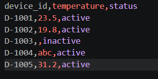
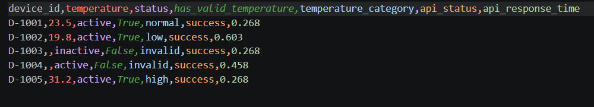
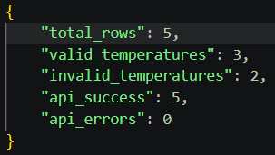

# Device Data Pipeline (Python CLI, Async API Integration)
A Python CLI tool I built to process device data from CSV files — validating inputs, enriching records through external APIs, and exporting clean results.
The idea came from wanting to simulate a real industrial data pipeline (the kind you'd see feeding into monitoring or SCADA systems), and to get hands-on with async Python in a practical context.

## What it does
Takes a CSV of device data, validates it, categorizes temperature readings, enriches each record via asynchronous API calls, and outputs a clean CSV along with a JSON summary.
Load CSV → Validate → Transform → Async API calls → Merge → Export

## Design Approach
The project is structured with separation of concerns in mind:
- Processing logic is isolated from API communication
- Validation is handled independently
- Async operations are centralized in the API layer
- Structured data models (Pydantic) used for API responses

This makes the pipeline easier to extend, test, and adapt to real-world scenarios.

## Project structure
```text
app/
├── main.py         # CLI entry point & argument parsing
├── processor.py    # Core workflow orchestration
├── api_client.py   # Async API communication layer
├── validators.py   # Input validation logic
├── models.py       # Data models (Pydantic-ready)
```
I kept the modules intentionally separate — validation, processing, and API logic don't bleed into each other, which made testing and extending things much easier.

## Tech Stack
- Python
- pandas (data processing)
- asyncio & aiohttp (asynchronous API calls)

## Running it
```bash
pip install -r requirements.txt

python -m app.main \
  --input data/input/devices.csv \
  --output data/output/result.csv
```
Outputs:
data/output/result.csv — enriched dataset
data/output/summary.json — processing stats

## Example

### Input (raw device data)


### Output (processed & enriched)



### What happens during processing

- Invalid or missing temperature values are detected
- Temperature values are categorized (low / normal / high)
- Each device is enriched via async API calls
- Additional metadata (API status & response time) is added

## What I'd add next

Retry/backoff for flaky API calls
Structured logging to file
.env / YAML config support
Docker setup
Hook into real industrial protocols (OPC UA, etc.)


Built to simulate real-world data processing workflows and strengthen practical experience in async Python, API integration, and clean software design.